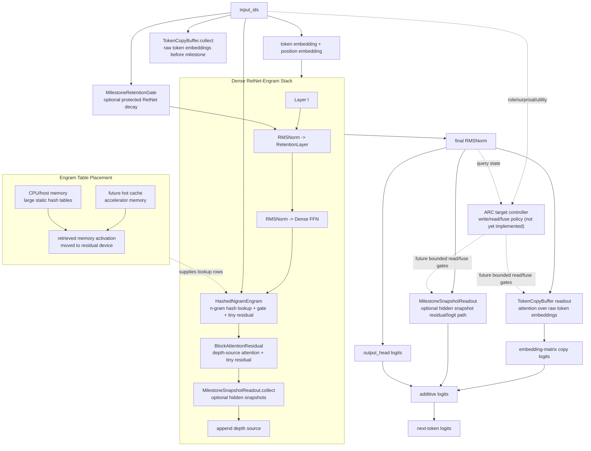

# Current Model Architecture

Date: 2026-05-11

Status: current implementation map after proof cleanup and Engram CPU offload
hook.

## Mode Diagram



## Module Roles

| Module | Role | Current claim |
|---|---|---|
| RetentionLayer | Default sequence mixing with recurrent-state path. | Small-state backbone, not exact recall by itself. |
| Dense FFN | Phase-1 channel-mixing baseline. | Keeps MoE out until memory paths are isolated. |
| HashedNgramEngram | Static/semi-static N-gram lookup with gated residual injection. | Conditional memory table; now supports CPU table placement. |
| BlockAttentionResidual | Depth-axis reuse of previous block/layer sources. | Direct value path under attention-mass and alignment assumptions. |
| MilestoneRetentionGate | Optional protected retention window after milestone tokens. | Bounds decay only under trigger and leakage assumptions. |
| MilestoneSnapshotReadout | Optional hidden-state snapshot path. | Exact-token support only under capture/readout/margin conditions. |
| TokenCopyBuffer | Optional raw token-embedding copy path. | Exact-copy logit path only under capture, attention, and margin conditions. |
| ARC (target design) | Small controller for write/read/fuse decisions across bounded memory. | Not implemented; valid only under fixed caps, address-margin, fusion-margin, and anti-collapse conditions. |

## Memory Contract

```text
per stream memory =
  RetNet recurrent state
  + bounded ARC controller state (target)
  + bounded snapshot/copy buffers
  + bounded depth summaries
  + Engram retrieved activations
```

ARC is the proposed unifying control surface for "when to write, what to write,
which slot to read, and how to fuse the retrieved value." It must not attend
over all past tokens. If its memory caps grow with context length, the resource
claim must expose that growth instead of calling the path small-state.

Large Engram tables may be placed in CPU/host memory through
`engram_table_device="cpu"`. That reduces accelerator residency for static
lookup tables, but introduces synchronous transfer overhead until a hot-cache or
async-prefetch layer exists.
